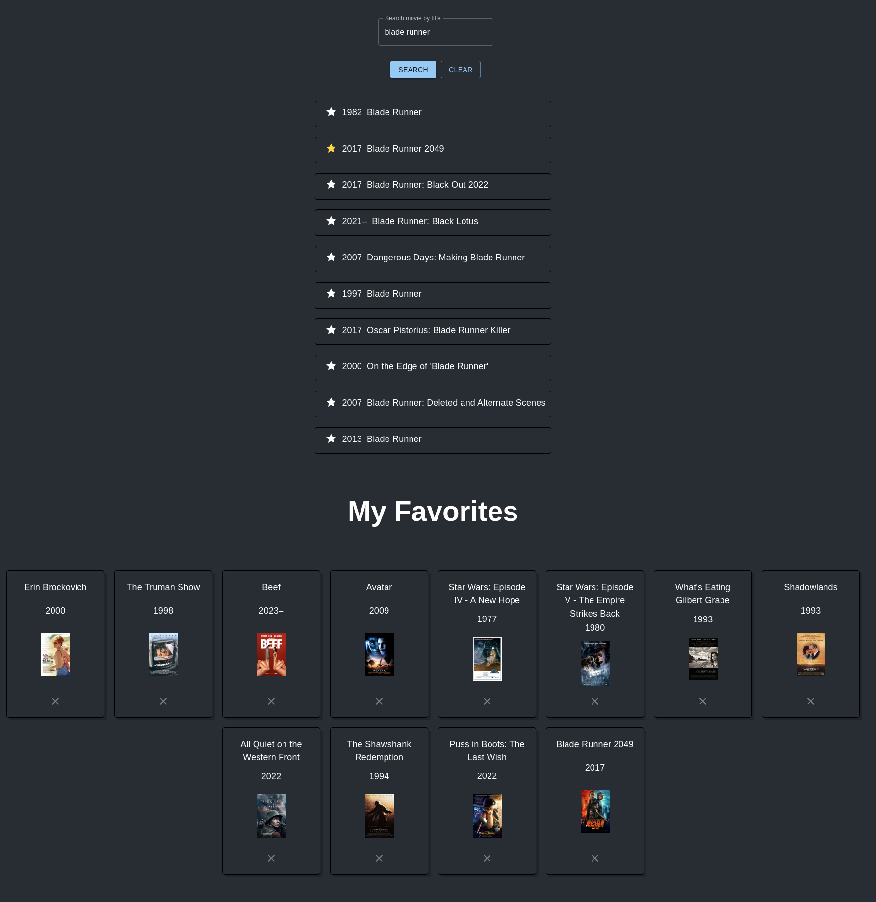

# Declaration
I declare that this is my own work and that all sources that I have used are
indicated and acknowledged by means of references. I have not consulted any
prior attempts at this exercise. Github Copilot was enabled during the
development of this project. 




# Context
## Architecture
I used the traditional 3-tier architecture with a frontend, backend and
database. I used an awesome-compose template as the boilerplate.
https://github.com/docker/awesome-compose/tree/master/react-rust-postgres

This the template already provides the DB migrations component which the Rust
ecosystem already makes so effortless yet robust.

## Why Rust?
I've slowly been upskilling in Rust for the past couple of months so I'm using
every excuse I can to use it.

## Were this going to production
In the book, *Software Engineering at Google* (O'Reilly Media, Inc., 2020) the
authors emphasize that a key parameter of any software project is the **expected
lifetime** of the code. Since this value can vary anywhere from a couple of
minutes to decades, I believe this is a key parameter that must drive the
software and infrastructure design.

Since this project will likely be in use for only a couple of minutes, I have
explicitly discarded some of the usual patterns and practices one might expect
in a typical full-stack application. I mention this to ensure it is clear that I
have not ommited them due to lack of knowledge or experience.

- Use a more standard MVC design pattern for both the backend and frontend
- Use Typescript for the frontend
- Unit tests! 
- Wrap the db connection pool in a middleware
- Front-end paging of movies
- Replace Material UI with a own components

## Misc
- Favicon generated with DALL-E

# Todo
- [ ] Test on M1. State if it does not work.


# Dependencies
- `docker`
- `docker-compose` >= 2.x.x

# Running
Create the `.env` file and add your OMDb API key
```bash
cp env.example .env
vim .env
```

In the project root run
```bash
docker-compose up -d
```
NB: On first time deploy the DB needs to initialise before the backend can
connect to it. The backend container will fail. Monitor the DB logs until it is
ready to accept connections then restart the service
```bash
docker-compose logs db -f # Follow the logs to inspect 
docker-compose restart backend # Restart the backend
```

You can manually query the API directly with curl
```bash
curl "localhost:8000/movies"
curl "localhost:8000/movies?title=truman"
```     

Visit `localhost:3000` in your browser to view the frontend

